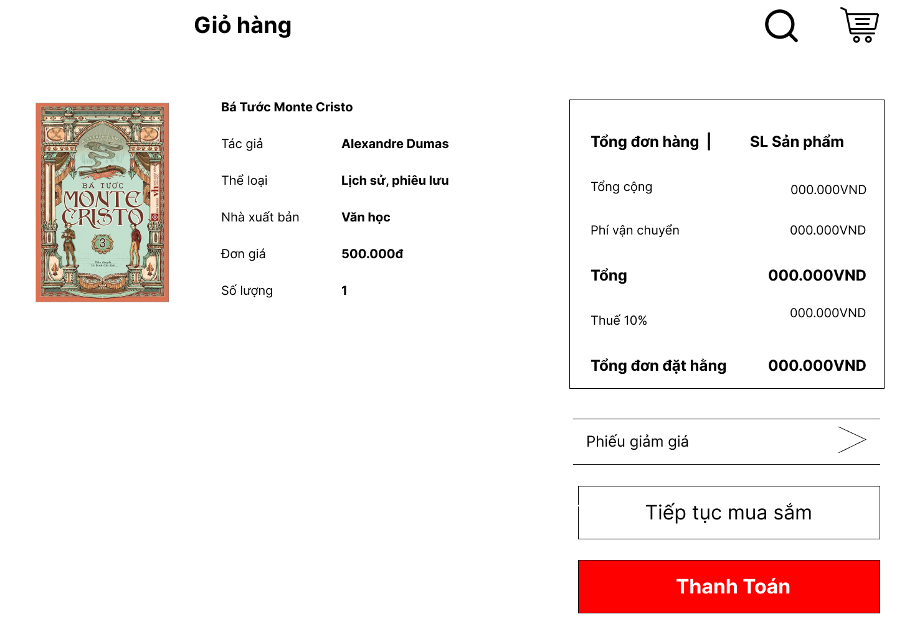
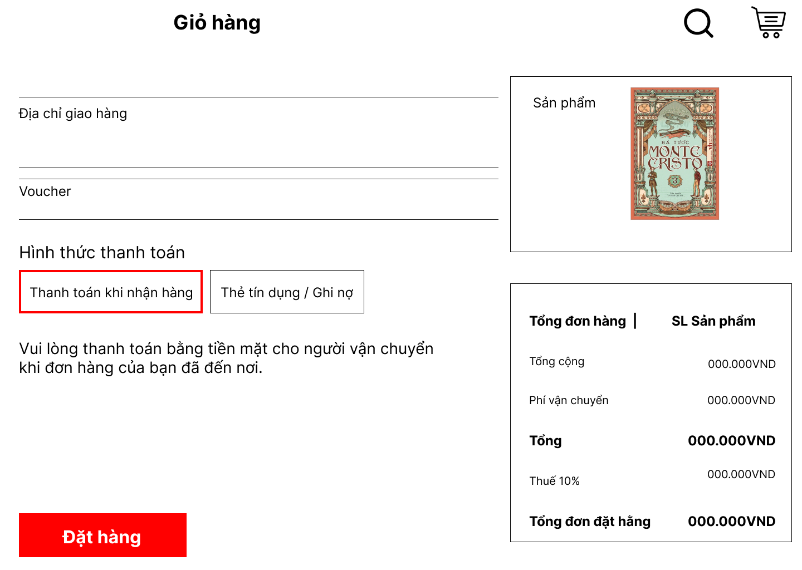
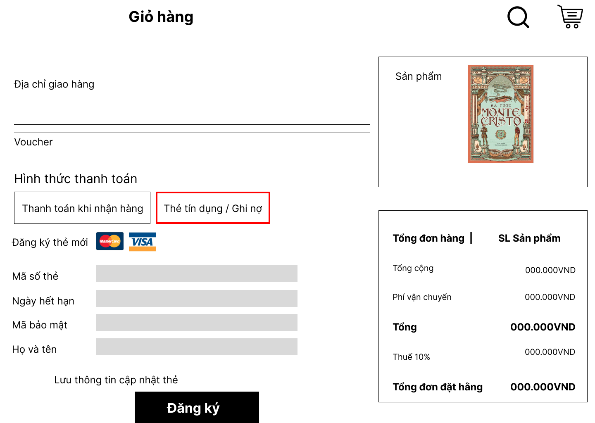

| Title: | Manage Books |
| ------ | ------ |
| Value Statement: | As a book manager, I want update, delete, search, order books by genre and manage books in the database, so that I can manage the inventory and availability of books. |
| Acceptance Criteria: | Scenario 1: Given a page with a form to see the all the books ( id , name, author )   When the book manager access the page.   Then a page show all the books. |
| Definition of Done | <ul> <li>Unit Tests Passed</li> <li>Acceptance Criteria Met</li> <li>Code Reviewed</li> <li>Functional Tests Passed</li> <li>Non-Functional Requirements Met</li> <li>Product Owner Accepts User Story</li> </ul> |
| Owner | Book Manager |
| Iteration | Unscheduled |
| Estimate | 5 Points |

# Test Case
| Test Case ID | Test Objective | Precondition | Steps | Test Data | Expected Result |
| ------ | ------- | ------- | ------- | ------- | -------- |
| TC1 | Search boosks by genre in database | Book manager is logged in and in the manage books page | 1. Change genre name in the combo box   2. Verify that the results show only books that match the genre | Book's information needed to be searched | The book manager can find books by genre in the database |
| TC2 | Update books in the database | Book manager already has book information that needs to be updated | 1. Click on button Update   2. A window appears asking if you want to confirm or not   3. Click on button submit to confirm update the book | Book's information needed to be updated | The book that needed to be updated has updated |
 
# Main User Interface

# 2180607518
|       Title    		|Customer check out cart and makes payment            
|------------------------|-------------------------------|
| Value | As a customer, I want to be check out my cart and payment, so I can review the products I choose.|
|Acceptance Criteria	|1. Adding Items to Cart: Users can add products to the cart by clicking the "Add to Cart" button on product pages.  2. Cart Interaction:  Users can easily change the quantity of items in the cart (increase/decrease/remove). 3. Shipping and Tax Calculation: The cart calculates shipping fees based on the user's selected shipping method and location. 4. Payment Information: Users can enter payment information securely, including credit card details or other payment methods. 5. Order Review: Users can review their delivery information and upon receipt can review the item. 6. Payment Processing: After confirming the order, the system processes the payment securely and efficiently. 7. Payment Gateway Integration: Can link with banks and other payment platforms, Payment gateway integration is thoroughly tested to ensure successful transaction processing.             |
|Definition of Done         |1.Functional Requirements. 2.User Acceptance Testing. 3.User Interface (UI/UX). 4.Data Management  5.Testing and Verification. |
|Owner          |Responsible person: Huynh Truong Hoan|
|Interation | Unscheduled|
|Estimate: | 5 Points |

# 2180608413
|       Title    		| Search books |
|------------------------|-------------------------------|
|Value Statement	|As a customer, I want to find books quickly so I can view or buy the books I want            |
|Acceptance Criteria        |Given that  to already know the information of book . When customers enter into the search box.  Then a list of related books appears for customers to search.|
| Definition of Done | <ul> <li>Unit Tests Passed</li> <li>Acceptance Criteria Met</li> <li>Code Reviewed</li> <li>Functional Tests Passed</li> <li>Non-Functional Requirements Met</li> <li>Product Owner Accepts User Story</li> </ul> |
|Owner          |Hoai Phuong| |
 | Interation: | Unscheduled 
 | Estimate: | 5 point
 | Interation | 5 point|
  |

# 2180603433
| Title: | FeedBack |
| :-------- | :----------------- |
| Value Statement: | As a customer,  I would like to be able to give feedback on the product,   my experience or submit store advice, to share your opinion and help improve the store's services.  |
| Acceptance Criteria: | Acceptance Criterion 1:   Customers need to be notified of successful submission of their feedback or advice  All feedback must be stored in the store's database for future reference and analysis  If necessary, the store should have the ability to contact customers to request additional information or provide personal feedback      Acceptance Criterion 2:  If any changes or improvements are made to products or services based on customer feedback, the store should notify customers about this.  The store should have a clear policy on accepting or rejecting inappropriate or rule-violating feedback  The system needs to undergo performance testing to ensure that the process of providing feedback does not negatively impact the user experience   |
| Definition of Done | <ul> <li>Unit Tests Passed</li> <li>Acceptance Criteria Met</li> <li>Code Reviewed</li> <li>Functional Tests Passed</li> <li>Non-Functional Requirements Met</li> <li>Product Owner Accepts User Story</li> </ul> |
| Owner: | Khang | Owner |
| Iteration: | Unscheduled |
| Estimate: | 5 Points |

# 2180608203
|      Title          |   Show menu of books                                         ||
|----------------|-------------------------------|-----------------------------|
|Value Statement|        As a bookseller, I want to be able to view a menu that lists all the available books to the customer, so that they can easily browse and select the book they want to buy. |          |
|Acceptance Criteria          |Given the menu display a list of books, each book should be displayed with its title, author, and a brief description. When the customers open app or click on the list of books.   Then a list with many book genres appears, this menu should be easy to navigate and scroll through and Clicking on a book should open a detailed view or page providing more information and option as adding it to wishlist or purchasing it              |      |     
| Definition of Done | <ul> <li>Unit Tests Passed</li> <li>Acceptance Criteria Met</li> <li>Code Reviewed</li> <li>Functional Tests Passed</li> <li>Non-Functional Requirements Met</li> <li>Product Owner Accepts User Story</li> </ul> |
|		Owner			|			Tran Thanh Tuong					|			|				
|			Iteration		|		Unscheduled							|			|			
|					Estimate|5 Points								||

